<div id= "header" align="center">
    
    <h1>Micah Kepe 💻</h1>
    <div id="badges" align="center">
        <a href="https://www.linkedin.com/in/micah-kepe/">
            <code>LinkedIn</code>
        </a>
        <a href="https://www.instagram.com/micahkepe/">
            <code>Instagram</code>
        </a>
        <a href="https://x.com/micahkepe">
            <code>X</code>
        </a>
    </div>
</div>

<br/>

```
## About Me

👋 Hi, I'm Micah Kepe, a computer science student at Rice University.

## Languages and Tools

Some of my favorite tools and technologies include:

* Languages: Python, Java, JavaScript, TypeScript, C, Go, Rust, HTML, CSS
* Frameworks: React, NodeJS, NestJS
* Databases: MongoDB, PostgreSQL, MySQL
* Tools: Git, Docker, TensorFlow, Keras, PyTorch, OpenCV

## GitHub Stats
```

<p align="center">
	
</p>
